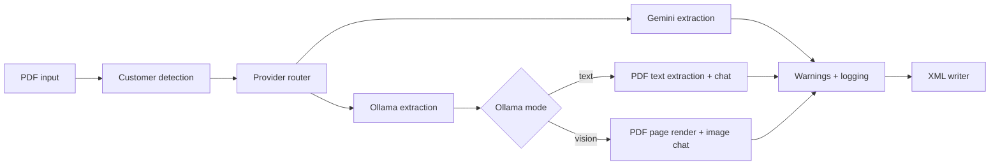

# PDF Technical Drawing Extractor

Production Python CLI for extracting manufacturing data from technical drawing PDFs using Google Gemini or local Ollama models.

Built for ALES workflows with customer-specific logic for ELTEN and Rademaker.

## Why this project exists

Technical drawing PDFs contain high-value information (BOM rows, tolerances, hole specs, material, coating) that is expensive to process manually and error-prone to OCR.

This tool extracts that data into structured XML so it can feed downstream planning and production systems.

## What gets extracted

- Part number
- Surface treatment
- Holes (tapped/normal/toleranced)
- Toleranced lengths
- Material and thickness
- BOM part references
- Operator warnings (human-readable summary)

## Quick start

```bash
python -m venv .venv
source .venv/bin/activate  # macOS/Linux
# .venv\Scripts\activate  # Windows

pip install -r requirements.txt
pip install -e .
```

Create `.env` in repo root:

```env
GEMINI_API_KEY=your_api_key_here
```

Run:

```bash
# single PDF with auto customer detection
pdf-extract drawing.pdf --customer auto

# batch folder with auto customer detection
pdf-extract /path/to/order_folder --customer auto

# local Ollama model
pdf-extract drawing.pdf --provider ollama --model llama3.1:8b --customer base

# Ollama vision model
pdf-extract drawing.pdf --provider ollama --model qwen2.5vl:7b --ollama-mode vision --customer base
```

Output: `PDF_XML_<foldername>.xml`

## Build and distribution

This repository supports creating a standalone executable for users who should run the tool without receiving the full source tree.

### 1) Install build dependencies

```bash
pip install -r requirements-build.txt
```

### 2) Build binary

```bash
python build_executable.py
```

### 3) Share artifact

- macOS/Linux: `dist/pdf-extract`
- Windows: `dist/pdf-extract.exe`

### Runtime note for distributable builds

The executable includes the `config/` directory and resolves it correctly in frozen mode.

### Security expectation

Executable distribution reduces casual source visibility but does not provide hard anti-reverse-engineering guarantees for Python code.

## Custom model workflow (Ollama)

You can run the extractor against local Ollama models with a provider switch.

### 1) Start Ollama

```bash
ollama serve
```

### 2) Pull a model

```bash
ollama pull llama3.1:8b
```

### 3) Run extractor with Ollama provider

```bash
pdf-extract drawing.pdf --provider ollama --model llama3.1:8b --customer base
```

### 4) Vision-capable Ollama flow (recommended for drawings)

```bash
ollama pull qwen2.5vl:7b
pdf-extract drawing.pdf --provider ollama --model qwen2.5vl:7b --ollama-mode vision --customer base
```

Optional custom Ollama URL:

```bash
pdf-extract drawing.pdf --provider ollama --model llama3.1:8b --ollama-url http://localhost:11434 --customer base
```

Important behavior:

- `--provider gemini` (default): native PDF vision path
- `--provider ollama`: local model path with selectable mode (`text`, `vision`, `auto`)
- `--customer auto` is Gemini-only; in Ollama mode it falls back to `base`

### Ollama model options (state of the art snapshot)

These are practical options in the current Ollama ecosystem for technical-document extraction.

| Model | Mode | Relative quality on technical drawings | Speed | Notes |
|-------|------|----------------------------------------|-------|-------|
| `qwen2.5vl:7b` | vision | High | Fast-Medium | Strong OCR + layout understanding for local use |
| `qwen2.5vl:32b` | vision | Very High | Slower | Best local quality tier if hardware allows |
| `llama3.2-vision:11b` | vision | Medium-High | Medium | Good all-rounder, easy default vision option |
| `minicpm-v:8b` | vision | Medium | Fast | Lightweight vision choice |
| `llama3.1:8b` | text | Medium-Low on scanned drawings | Fast | Best for text-rich PDFs with extractable text |

Quality note:

- Gemini remains strongest for complex visual reasoning in production benchmarks.
- Ollama vision models can be very competitive locally, especially with clean drawings and good GPU memory.

## Documentation site (Zensical)

This project includes a full Zensical documentation site.

### Local preview

```bash
zensical serve
```

### Production build

```bash
zensical build --clean
```

### Docs structure

- Config: `zensical.toml`
- Pages root: `docs/`
- Output: `site/` (ignored by git)

## Architecture overview



### Core modules

- `extractor/main.py`: CLI orchestration for single and batch mode
- `extractor/model_service.py`: provider routing (`gemini` or `ollama`)
- `extractor/gemini_service.py`: Gemini API calls and response handling
- `extractor/ollama_service.py`: Ollama local API calls and JSON extraction
- `extractor/config_loader.py`: base/customer config loading and deep merge
- `extractor/prompt_builder.py`: dynamic prompt composition
- `extractor/customer_detection.py`: first-PDF customer auto-detection
- `extractor/operator_warnings.py`: manufacturing warning generation
- `extractor/xml_writer.py`: XML serialization
- `extractor/csv_logger.py`: per-PDF operational log records

Detailed diagrams and control flows are documented in `docs/reference/architecture.md`.

## Models

| Model | Cost/PDF | Recommendation |
|-------|----------|----------------|
| `gemini-2.5-pro` | ~€0.07 | Default for best extraction quality |
| `gemini-2.0-flash` | ~€0.025 | Faster/lower-cost production option |
| `gemini-2.0-flash-lite` | ~€0.010 | Budget/testing only |

## Customer modes

| Value | Meaning |
|-------|---------|
| `auto` | Detect customer from first PDF |
| `elten` | ELTEN-specific extraction rules |
| `rademaker` | Rademaker-specific extraction rules |
| `base` | Generic fallback rules |

## Example XML output

```xml
<?xml version="1.0" encoding="UTF-8"?>
<Order>
  <Metadata>
    <TotalPDFs>20</TotalPDFs>
    <SuccessfulPDFs>18</SuccessfulPDFs>
    <FailedPDFs>2</FailedPDFs>
    <DetectedCustomer>ELTEN</DetectedCustomer>
  </Metadata>
  <Items>
    <Item>
      <PartNumber>MD-22-08803</PartNumber>
      <Material>S235 8 mm</Material>
      <SurfaceTreatment>Poedercoaten</SurfaceTreatment>
      <Holes>
        <Hole count="4" type="tapped" threadSize="M6"/>
        <Hole count="2" type="normal" diameter="20" tolerance="H9"/>
      </Holes>
    </Item>
  </Items>
</Order>
```

## Additional references

- Deep technical background: [claude.md](claude.md)
- Site pages: `docs/`
